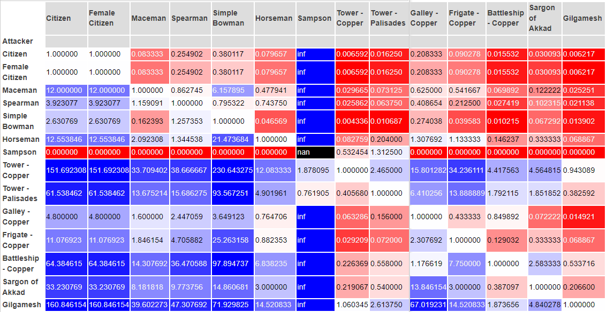

# empire_earth

Utilites for calculating [unit relationship matrices](https://empire-earth.readthedocs.io/en/latest/_autosummary/empire_earth.units.relationships.epochs.html)
in the game Empire Earth.

Here is an example of a unit relationship matrix for the Copper Age.
The attackers are along the left column and the defenders are along the top row.
Blue means that the attacker wins, red means that the defender wins.
The number is representative of how many units of the defender could the attacker kill in a fight.
It is calculated by incorporating the attack, attack multiplier, armor, and hitpoints of both the attacker and the
defender.

